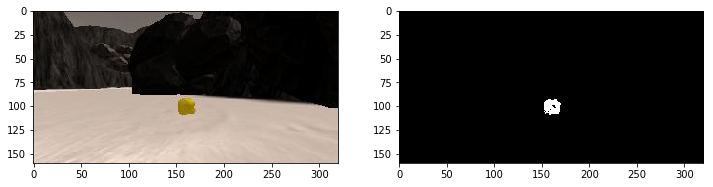

## Project: Search and Sample Return
This is a repository for Udacity Robotics Nanodegree Project1.
- [udacity/RoboND\-Rover\-Project: Project repository for the Unity rover search and sample return project\.](https://github.com/udacity/RoboND-Rover-Project)

Honestly, This project is difficult for me,
so I followed the [workthrough video](https://www.youtube.com/watch?v=oJA6QHDPdQw).

I'll describe this writeup with following the rubrics.
- [Udacity Reviews](https://review.udacity.com/#!/rubrics/916/view)

### Notebook Analysis
#### Run the functions provided in the notebook on test images (first with the test data provided, next on data you have recorded). Add/modify functions to allow for color selection of obstacles and rock samples.

##### obstacles
At first, I modified `perspect_transform` to return masks, which is used to detect obstacle

```python
def perspect_transform(img, src, dst):
    M = cv2.getPerspectiveTransform(src, dst)
    warped = cv2.warpPerspective(img, M, (img.shape[1], img.shape[0]))
    mask = cv2.warpPerspective(np.ones_like(img[:,:,0]), M, (img.shape[1], img.shape[0]))
    return warped, mask
```

##### rocks
Also, I add new function to detect rock.

```python
def find_rocks(img, levels=(110, 110, 50)):
    rockpix = (img[:,:,0] > levels[0]) & \
              (img[:,:,1] > levels[1]) & \
              (img[:,:,2] < levels[2])
    color_select = np.zeros_like(img[:,:,0])
    color_select[rockpix] = 1

    return color_select
```

It works like below.



#### Populate the `process_image()` function with the appropriate analysis steps to map pixels identifying navigable terrain, obstacles and rock samples into a worldmap.  Run `process_image()` on your test data using the `moviepy` functions provided to create video output of your result.

First, Applied perspective transform.Then, applid color threshold to identify navigable terrain/obstacles/rock samples.

```python
threshed = color_thresh(warped)
obs_map = np.absolute(np.float32(threshed) - 1) * mask
rock_map = find_rocks(warped, levels=(110,110,50))
```

Converted thresholded image pixel values to rover-centric coords.

```python
xpix, ypix = rover_coords(threshed)
obsxpix, obsypix = rover_coords(obs_map)
rock_x, rock_y = rover_coords(rock_map)
```

Converted rover-centric pixel values to world coords.

```python
x_world, y_world = pix_to_world(xpix, ypix, xpos, ypos,
                               yaw, world_size, scale)
obs_x_world, obs_y_world = pix_to_world(obsxpix, obsypix, xpos,ypos,
                                        yaw, world_size, scale)
rock_x_world, rock_y_world = pix_to_world(rock_x, rock_y, xpos, ypos,
                                          yaw, world_size, scale)
```

Finally, Update worldmap.

```python
data.worldmap[y_world, x_world, 2] = 255
data.worldmap[rock_y_world, rock_x_world, 1] = 255
data.worldmap[obs_y_world, obs_x_world, 0] = 255
```

output video is [here](https://youtu.be/O9J_4-v5fng).

### Autonomous Navigation and Mapping

#### Fill in the `perception_step()` (at the bottom of the `perception.py` script) and `decision_step()` (in `decision.py`) functions in the autonomous mapping scripts and an explanation is provided in the writeup of how and why these functions were modified as they were.

##### perception_step
perception_step() is simmilar to the `process_image()` in jupyter notebooks. so I copy and paste the code.

I modified to use Rover class. For example, I updated Rover's state as below.

```python
Rover.vision_image[:, :, 2] = threshed * 255
Rover.vision_image[:,:,1] = rock_map * 255
Rover.vision_image[:, :, 0] = obs_map * 255
```

```python
Rover.worldmap[y_world, x_world, 2] += 10
Rover.worldmap[obs_y_world, obs_x_world, 0] += 1
Rover.worldmap[rock_ycen, rock_xcen, 1] = 255
```

##### decision_step
I didn't modify decision_step function. I used default sample code.

#### Launching in autonomous mode your rover can navigate and map autonomously.  Explain your results and how you might improve them in your writeup.  

My simulator settings are,
- Screen Resolution: 1024 x 768
- Graphic quality: Good
- Frame per second: 16-22

The result was
- 54.1% map
- 57.4% fidelity
- 3 rocks located

The result video is [here](https://youtu.be/_8c1yb37sws)(youtube)

The Problems are
- When facing big obstacls, rover stoped and can't move.
- sometimes rover run in a circle forever.

And further improvement are(If I have more time, I'll...)
- pickup rocks
- create map 100%
- return to the starting point

end.
